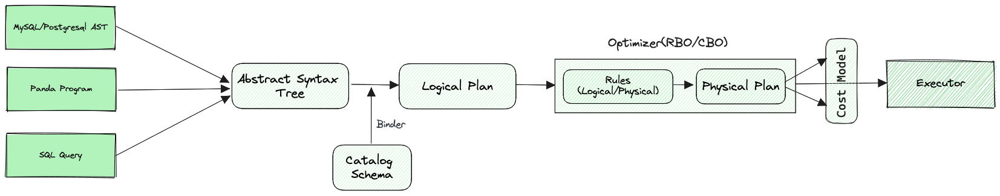
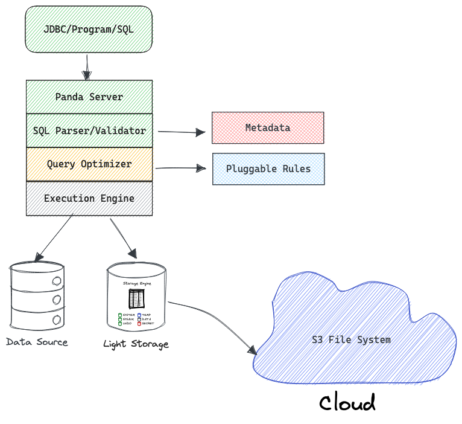

Panda 优化器架构设计，主要使用 Volcano(Cascades) Optimizer 论文思想以及工业界主流优化器经验结合。

## 👋 概览



## 📕 设计



工程实现，能兼容多种访问 Panda 的模式，也能兼容 MySQL/PG 的语法，初步优先支持 MySQL 语法。

优化器是 Cascades 的实现，研究并参考成熟的工业界实现，Rules 和 Metadata 灵活扩展性，Metadata 接口标准化，默认 Catalog In Memory 实现。

## ☄️ 实现

优化器包含两个核心模块：
* SQL 解析器
* SQL 优化器

### SQL 解析器

解析器 yacc/lex 进行 SQL 文本进行语法解析、词法分析变成一颗 TreeNode 二叉树，Rust 语言有很多工具帮助做这件事：
* sqlparser-rs 手写的 SQL 解析器，Rust 项目中使用率最高的 SQL 解析器。
* nom-sql  基于 nom 实现的一个 sql 解析库，半成品，nom 像写函数一样写 SQL 解析器。
* grmtools rust 的 yacc 库，需要手写词法解析

### SQL 优化器

利用 SQL 解析器把 SQL Text 变成一颗 TreeNode 二叉树，如何根据 TreeNode 找到一个最优的执行计划？

首先，需要把 TreeNode Binding Catalog 中的 Metadata，检测表、库、字段、函数等是否合理，把这些信息记录到相应的 TreeNode 中，
为了方便记录一些扩展信息以及 LogicalPlan 到 PhysicalPlan 优化转换，这里把 TreeNode 转换为 LogicalPlan。

```rust
 /// Generate a logic plan from an SQL query.
    /// It's implementation of `subquery_to_plan` and `query_to_plan`.
    /// It shouldn't be invoked directly.
    fn query_to_plan_with_schema(
        &self,
        query: SqlNode,
        planner_context: &mut PlannerContext,
    ) -> Result<LogicalPlan> {
    	TODO: SqlNode 逐个处理，转换为 LogicalPlan
    }
```

其次，LogicalPlan 使用 Rules 规则进行优化，使用 Cascades 思想进行 RBO 和 CBO, 
每一个 Node 应用 rules，只要 apply 成功，跳出本轮循环，继续下一个 Node，运行全部规则。

原则，每个 node 仅应用一次规则，规则应用次数、优化时间等维度，满足任意结束优化，返回最优的一个计划。

```rust
let sqlNode = Parser::parse_sql(sql, options);
let logicalPlan = query_to_plan_with_schema(sqlNode, context);
let physicalPlan = optimizer(logicalPlan, context);
// physical to execution engine
```

如上，optimizer 把 LogicalPlan 进行 Cascades 优化，最终输出一个最优的 PhysicalPlan，提交给执行引擎调度执行。

:::noteing
单机数据库较为简单，物理执行计划直接转为一个直接进行并行执行的 DAG 图，自顶向下 next 调用，顶端 next 为 empty 或 NULL，执行结束，返回结果。

如果是分布式数据库，物理执行计划这里需要感知数据分布、可用 worker 数、负载等信息，把 physicalPlan 拆分成能多机并发执行的多个 subPlan 下发
到 worker 进行执行，协调节点负责收集结果返回给客户端。

plan 拆分成 subPlan 不同的数据库可能采用不同的设计？

* 水平切分（INTRA-OPERATOR PARALLELISM）(Horizontal)
* 垂直切分（INTER-OPERATOR PARALLELISM）(Vertical)
* 横向 + 纵向切分（BUSHY PARALLELISM）

一般采用横向切分方式较多，利于并发执行、逻辑清晰，重复考虑数据分布、集群负载、单机并行和分布式并行。
:::

### Cascades 真实系统

* Microsoft SQL Server
* Apache Calcite
* Greenplum ORCA
* Cockroachdb
* TiDB

## ❓ 疑问

研究工业界的实际实现方式，我们把一些问题或细节处理梳理到这部分内容。

### Logical Plan 起点

SQL Text 解析为抽象语法树，然后转换为 Logical Plan，有没有什么优化的地方。

### 分布式执行计划拆分

分布式执行计划，如何拆分实现高效率的并发执行，阅读[执行引擎](../execution/introduction)部分。

## 附录

* [17 - Query Optimizer Implementations - Part 2 (CMU Advanced Databases / Spring 2023)](https://www.youtube.com/watch?v=PXS49-tFLcI)
* [17-optimizer2.pdf](https://15721.courses.cs.cmu.edu/spring2023/slides/17-optimizer2.pdf)
* [CMU 15-721 SPRING 2023 Advanced Database Systems](https://15721.courses.cs.cmu.edu/spring2023/)