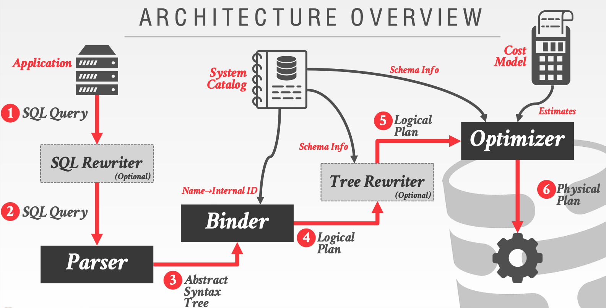

我们会研究 Rust 生态的一些优化器实现、首先实现完全兼容 MySQL 语法和协议的服务，未来也不排除会实现 PG 语法和协议服务。

国内生态，考虑优先支持 MySQL 兼容的 MySQL Parser 层和 MYSQL Protocol 协议，能在 Rust 生态被共用，OLTP、OLAP 都能共用的优化器。

设计考虑，未来逐步完善优化器层，孵化单机 OLTP 以及分布式 OLAP 数据库。

* OLTP 单机，完整实现
* OLAP 分布式
	- Coordinator 节点 Rust 实现
	- Worker 节点 Code Base（Velox）
	- Storage on S3，支持数据湖存储格式

主要研究 Apache Calcite，构建 Rust 版本，前期以启发式 / 规则(Heuristics / Rules) RBO 为主要实现。

* 阅读论文
* 研究代码

## ❓ 背景

***IBM SYSTEM R***，始于 1970 年。

上世纪70年代首次实现的查询优化器。

- → 有人认为数据库管理系统永远无法比人类编写的查询计划更好。

许多来自 `System R` 优化器的概念和设计决策至今仍在使用。

## 📕 优化器（Volcano/Cascades) 原理

一个 SQL 查询性能，极大概率是优化器决定的，优化器核心理论是`关系代数等价`(Relational Algebra Equivalences)。

经过多年的研究和实践，优化器基于关系代数等价原理，整个 SQL 查询用一棵 Tree 来表示，优化过程就是不断改变 Tree 结构，使得它以最小的代价执行。

而决定是否改写，如何改写 Tree，主要利用动态规划算法，把一个复杂问题拆解成子问题求解。

Tree 是一个二叉树：

* 首先应用 RBO (启发式/规则) 优化，实践积累下来的经验规则。
* 然后应用 CBO（成本模型）优化，结合数据统计信息动态调整 Tree，成本优化一般代价较大。

动态规划搜索最优计划过程中，需要考虑性能问题，有一些成熟的思想，主流选择 Volcano/Cascades 设计方案，Cascades Framework 已经被很多常见的数库实现。

Cascades 基于 Volcano 做了诸多改进，二者出自同一作者（Goetz Graefe），很多文献把 Volcano/Cascades 名词混用。

### 架构



如图（来自CMU 15-445），优化器架构概览：

词法分析 & 语法解析输出 SqlTree(抽象语法树）: SQL Query -> SQL Rewriter(可选) ->  Parser

Binder 阶段输出 Logical Plan：读取 Catalog Metadata 数据，列名重写为ID 等；验证 Database、Table、Columns、Index、Functions 等合法性；
抽象语法树组装成 Logical Plan Tree，逻辑执行计划的起点。

Tree Rewriter(可选）：结合 Scheme Info 进行 Tree Rewriter （可选择)，做一些语法兼容，比如：兼容 MySQL/Oracle 语法等，把其他系统查询语法树改写为当前系统能识别的查询语法树，
一般基于 Logical Plan 改写相对简单，抽象语法树层面改写较为困难；

Optimizer(优化)：结合 Catalog Schema 信息进行启发式/规则 RBO 优化，之后继续进行成本模型（依赖统计信息） CBO 优化；如果选择 Cascades 设计，不在严格区分逻辑计划和物理计划阶段，而是把他们融合在一起进行搜索，可以提升搜索性能，减少逻辑计划阶段存储大量不会被使用到 plan，降低无效搜索。
输出一个较优的 Physical Plan，提交给调度器执行。

优化器只能在有限的时间内，找到相对较优的执行计划，而一个 SQL 查询，特别是 TP 场景，毫秒级响应，给优化器预留的时间有限，查找最优执行计划大多是基于规则的优化，成本模型优化较少。
而 AP 场景，则会有不同的侧重点，优化器的设计上 AP 和 TP 也可以有正对性的一些优化。

:::note
Logical Plan和 Physical Plan 是存在差异的，并不是 1:1 的映射关系，Physical Plan 某些场景需排序、压缩等会增加一些新的节点，而 SQL 未显示指定。
:::

### 查询优化1

启发式 / 规则(Heuristics / Rules)
* → 重写查询以消除愚蠢 / 低效的部分。
* → 这些技术可能需要检查 Catalog，但无需检查数据。

基于成本的搜索(Cost-based Search)
* → 使用模型估算执行计划的成本。
* → 对查询评估多个等效的计划，并选择成本最低的一个。

***启发式 / 规则(Heuristics / Rules)***

基于经验的启发式 / 规则，进行执行计划的优化

#### PROJECTION PUSHDOWN

投影下推，TP 数据库来说，把 Project 提前下推到 Scan 中或 Scan 之前，保留 Join Keys 和必要的列，减少返回的数据集大小，提升性能。

#### Impossible / Unnecessary Predicates

消除谓词，减少无效计算。

```sql
SELECT * FROM A WHERE 1 = 0;

-- 等价于: 空结果

SELECT * FROM A WHERE FALSE;

SELECT * FROM A WHERE 1 = 1;

-- 等价于

SELECT * FROM A;
```

#### Join Elimination

```sql
SELECT A1.*
FROM A AS A1 JOIN A AS A2
ON A1.id = A2.id;

-- 等价于 

SELECT * FROM A;
```

#### Ignoring Projections

```sql
SELECT * FROM A AS A1 
	WHERE EXISTS(SELECT val FROM A AS A2 
		WHERE A1.id = A2.id);

-- 等价于

SELECT * FROM A;
```

#### Merging Predicates

```sql
SELECT * FROM A
 WHERE val BETWEEN 1 AND 100
	OR val BETWEEN 50 AND 150;

-- 等价于

SELECT * FROM A
WHERE val BETWEEN 1 AND 150;
```

#### Join reordering

Join 重排是一个复杂的问题，4^n 次方，使用限制搜索空间优化。

3个表的自然连接 A ⋈ B ⋈ C，可以改变的 Join 顺序有如下：

```
A ⋈ C ⋈ B
B ⋈ A ⋈ C
B ⋈ C ⋈ A
C ⋈ A ⋈ B
C ⋈ B ⋈ A
```

Join 顺序可能极大影响SQL执行的效率，优化阶段Join 重排规则把所有可能得连接顺序保留，由代价模型选择最优的Join顺序。为了避免代价被反复计算，使用动态规划的算法记录局部最优的代价。

* Join的顺序影响中间结果的数据量，决定了Join的执行效率
* Join的顺序影响具体Join算法的效率，决定了Join的执行效率

对于涉及多连接的查询，CBO将探索额外的连接顺序，以尝试找到成本最低的执行计划，这在某些情况下可以显着提高性能。

由于此过程会导致此类查询的逻辑计划数呈指数增长，因此默认情况下，它仅用于对包含8个或更少连接的子树进行重新排序（CockroachDB）。

* 穷举和验证最优方案的算法复杂度是指数级的（NP hard问题）
* 获取某个Join的中间结果数据量的代价很大，比如大数据中 Spark，使用 AQE 技术，动态调整执行计划，甚至有些数据库利用计算过程中统计信息重写后续执行计划片段（一般AP产品）。

Join 树一般为二叉树，Join 重排就是对二叉树进行改写。

Join树为 左深（Left-deep）树 ，对应的也有 右深树，在单机／单任务数据库上，我们只考虑这种形态的Join树就可以做Join重排。

#### 总结

我们可以使用静态规则和启发式方法来优化查询计划，而无需理解数据库的内容，启发式规则思想可以复用到任何的数据库优化器中。

Apache Calcite 中有 100+ Rule Base 规则，进行查询计划改写，孵化自 Hive，也是工业界比较成熟的基于规则优化器的项目。

***基于成本的搜索(Cost-based Search)***

#### COST ESTIMATION(成本估算)

一个查询需要多长时间？
- → CPU：成本较小；难以估计
- → 磁盘：块传输的数量
- → 内存：使用的DRAM数量
- → 网络：消息的数量

将读取/写入多少元组？运行每个可能的计划来确定这些信息太昂贵了，因此数据库管理系统需要一种方法来推导这些信息...

#### STATISTICS

数据库管理系统（DBMS）在其内部目录中存储有关表、属性和索引的内部统计信息。

不同的系统在不同的时间更新这些统计信息。

手动调用：
- → Postgres/SQLite: ANALYZE
- → Oracle/MySQL: ANALYZE TABLE 
- → SQL Server: UPDATE STATISTICS 
- → DB2: RUNSTATS

对于每个关系R，数据库管理系统（DBMS）维护以下信息：
- → NR：关系R中的元组数量。
- → V(A, R)：属性A的不同取值数量。

可推导统计量（DERIVABLE STATISTICS）:

选择基数 SC(A, R) 是具有属性 A 值的记录的平均数量，计算方法是 NR / V(A, R)。
需要注意的是，这假设数据均匀分布。
- → 如果有10,000名学生和10所大学，那么在 SCS（某个特定学院 S 中的学生数量）有多少名学生？

##### SELECTION STATISTICS

* Unique keys
> Equality predicates on unique keys are easy to estimate.
> 当一个查询在唯一键上进行等值匹配时，因为唯一键的值在数据库中是唯一的，所以DBMS可以很容易地推断出匹配的元组数量。

* Complex predicates
> 对于更复杂的谓词，它们的选择性（selectivity）是指谓词匹配的元组数量与关系总元组数量的比例。
> 选择性是用来衡量谓词在数据库中的广泛性或普遍性的指标。如果谓词很选择性（selective）较高，它将匹配较少的元组，查询的结果集将较小。
> 相反，如果谓词的选择性较低，它将匹配更多的元组，查询的结果集将较大。
> 选择性的高低对于优化查询计划非常重要。高选择性的谓词可以帮助优化器更准确地估计查询的结果集大小，从而选择更有效的执行计划。
> 相反，低选择性的谓词可能导致优化器做出不理想的选择，影响查询的性能。

SELECTIONS COMPLEX PREDICATES（选择复杂谓词)
> 计算公式取决于谓词的类型:
> → 等值谓词（Equality）的选择性：等于匹配谓词条件的元组数量与总元组数量的比例。
> → 范围谓词（Range）的选择性：等于在谓词条件范围内的元组数量与总元组数量的比例。
> → 否定谓词（Negation）的选择性：等于不匹配谓词条件的元组数量与总元组数量的比例。
> → 合取谓词（Conjunction）的选择性：等于同时满足多个条件的元组数量与总元组数量的比例。
> → 析取谓词（Disjunction）的选择性：等于至少满足一个条件的元组数量与总元组数量的比例。

* Equality Predicate
* Range Predicate
* Negation Query
* Negation Query
* Conjunction
* Disjunction

SELECTION CARDINALITY(选择基数)
> 选择基数（Selection Cardinality）是指满足谓词条件的元组数量。在数据库查询中，选择基数用于估算谓词操作的结果集大小。
> 选择基数通常用 SC(A, R) 表示，其中 A 是谓词涉及的属性，R 是关系。它是符合谓词条件的元组数量与关系 R 中的总元组数量的比例。
> - Assumption #1: Uniform Data
> - Assumption #2: Independent Predicates
> - Assumption #3: Inclusion Principle

CORRELATED ATTRIBUTES(关联属性)
> 关联属性（Correlated Attributes）指的是在数据库中存在相互关联或相关的属性。这意味着某些属性的取值可能受到其他属性取值的影响，或者它们之间可能存在某种依赖关系。

#### HISTOGRAMS WITH QUANTILES（带有分位数的直方图）

带有分位数的直方图（Histograms with Quantiles）是一种常见的统计工具，用于描述数据的分布情况。直方图是数据的分布图形，将数据按照不同的数值范围进行分组，并用柱状图表示每个组的数据频数或频率。

直方图与分位数的结合可以帮助我们更好地理解数据的分布，发现异常值或离群点，并辅助数据分析和决策过程。

#### SAMPLING（采样）

现代数据库管理系统（DBMS）还会从表中采集样本来估算选择性。当底层表发生显著变化时，会更新这些样本。

采集样本是一种常用的统计方法，它通过随机选取表中的一小部分数据来估算整个表的特征和性质。采样可以帮助优化器更准确地估计谓词的选择性，从而选择更有效的查询执行计划。

然而，由于数据库中的数据可能会随时间发生变化，因此采样可能会变得过时。为了确保估算的准确性，DBMS会在底层表发生显著变化时更新样本。这样，优化器就可以使用更接近实际数据分布的样本来进行查询优化，保持性能和效率。

定期更新样本是一种重要的策略，可以确保优化器在变化的数据环境中持续地做出最佳的查询执行计划。这有助于保持数据库系统的高性能和响应能力，以适应不断变化的数据需求。

:::note
Table SAMPLING（采样）在一些商业的数据库中有应用，能极大的改善查询性能，有效且不需要较大代价。
:::

#### 总结

现在我们可以（大致）估算谓词的选择性，那么我们实际上可以用这些估算值做些什么呢？

谓词的选择性估算在数据库查询优化中起着关键作用。通过了解谓词的选择性，优化器可以更准确地估计查询的结果集大小，从而选择更有效的查询执行计划。以下是我们可以利用谓词选择性估算的一些应用：

1. 查询优化：谓词选择性是优化查询计划的重要指标。选择性高的谓词能够更好地过滤数据，从而减少查询结果集的大小，提高查询性能。优化器可以根据谓词选择性来选择合适的索引或连接策略，以获得更快的查询响应时间。

2. 索引设计：对于高选择性的谓词，创建合适的索引可以大幅提高查询性能。通过根据谓词选择性来选择合适的列作为索引键，可以加速查询过滤过程，降低数据库系统的I/O成本。

3. 统计分析：谓词选择性估算也可以用于数据的统计分析。通过了解谓词条件对不同数据子集的过滤效果，可以发现数据中的潜在规律、异常值或重要数据子集。

4. 自适应优化：一些现代的数据库管理系统采用自适应优化技术，利用谓词选择性估算和实时查询执行结果来动态调整查询执行计划。这样可以在数据库运行时根据实际数据和查询情况进行优化，适应不断变化的环境和查询需求。

总之，谓词选择性估算是数据库系统中非常重要的一环，它在查询优化、索引设计和数据分析等方面都发挥着关键作用，帮助提高数据库系统的性能和效率。

### 查询优化2

在执行基于规则的重写后，数据库管理系统（DBMS）将为查询列举不同的计划，并估算它们的代价。这包括：

- → 单个关系的查询（Single relation）。
- → 多个关系的查询（Multiple relations）。
- → 嵌套子查询（Nested sub-queries）。

在尝试所有计划或达到一定的超时时间后，DBMS 会选择对于该查询来说最优的计划。优化器会通过比较不同计划的估算代价来选择最适合的执行计划，以实现最优的查询性能。

#### SINGLE-RELATION QUERY PLANNING

单关系查询规划（Single-Relation Query Planning）是指涉及单个关系（表）的查询，在优化器中选择最佳的数据访问方式。

在单关系查询中，查询仅涉及一个表，因此优化器可以专注于选择最合适的数据访问方法，以提高查询性能。以下是常见的数据访问方式：

→ 顺序扫描（Sequential Scan）：按照表中数据的物理存储顺序依次扫描所有元组。

→ 二分搜索（Binary Search，适用于聚集索引）：对于聚集索引，使用二分搜索来快速定位匹配的元组。

→ 索引扫描（Index Scan）：使用非聚集索引来定位匹配的元组，然后根据需要返回相应数据。

谓词评估顺序也是单关系查询规划的重要考虑因素。优化器需要决定在何时评估谓词条件，以减少不必要的数据访问和计算，提高查询执行效率。简单的启发式方法通常对于处理单关系查询足够有效。特别是在在线事务处理（OLTP）查询中，由于查询通常较为简单，优化器能够更轻松地做出优化决策。

通过优化单关系查询规划，数据库系统可以选择最优的数据访问方式和谓词评估顺序，从而提高查询性能，使查询响应更加高效。

#### OLTP QUERY PLANNING

对于在线事务处理（OLTP）查询，查询规划相对简单，因为它们通常是可搜索的（Sargable，即 Search Argument Able）。
- → 通常只需选择最佳索引。
- → 连接操作几乎总是基于具有较小基数的外键关系。
- → 可以使用简单的启发式方法来实现。

在OLTP环境中，查询通常是针对单个表的简单操作，例如根据某个条件进行筛选、投影或聚合。由于OLTP查询通常使用索引访问，并且连接操作涉及到较小的表（外键关系通常连接小的维度表和事实表），所以查询规划相对简单。

对于OLTP查询，优化器主要关注选择最佳的索引来加速查询操作，同时考虑筛选条件的选择性和索引的覆盖情况。由于OLTP查询通常是针对单个表的简单操作，所以优化器可以使用较为简单的启发式方法来选择最佳的索引和执行计划，而不需要复杂的优化算法。

因此，在OLTP环境中，由于查询的简单性和特定的数据访问模式（例如使用索引），查询规划相对容易，并且可以实现较好的查询性能。

#### MULTI-RELATION QUERY PLANNING

随着连接操作的数量增加，备选计划的数量会迅速增加。
- → 我们需要限制搜索空间。
在System R中的一个基本决策是只考虑左深度连接树（left-deep join trees）。
- → 现代数据库管理系统并不总是再做这个假设。

当查询涉及多个表之间的连接操作时，查询优化器需要考虑所有可能的连接顺序和计划，以选择最优的执行计划。随着连接操作数量的增加，备选计划的数量会呈指数级增长，这会导致优化器面临巨大的搜索空间，耗费大量计算资源和时间。

为了限制搜索空间并提高查询优化的效率，System R中引入了只考虑左深度连接树的决策。左深度连接树是一种特定的连接顺序，其中每次连接都是从左侧的表开始，依次向右连接。这种限制减少了备选计划的数量，简化了优化器的搜索过程，提高了查询优化的速度和效率。

然而，现代数据库管理系统不再总是遵循这个限制。由于现代DBMS具有更强大的优化器和查询优化算法，它们可以在更广泛的连接树类型中进行搜索，充分利用计算资源，选择更优秀的执行计划。因此，现代DBMS可以考虑更多的连接顺序和计划，以获得更好的查询性能。

左深度连接树的基本决策为数据库优化器提供了一种简单而高效的查询规划方法，允许生成流水线化的查询计划，提高查询性能。然而，要实现完全流水线化，仍需要考虑连接操作的复杂性和中间结果的传递方式。

#### Enumerate the orderings（枚举连接顺序）

枚举连接顺序：

对于涉及多个表的查询，首先需要枚举不同的连接顺序，即不同的左深度连接树。例如，对于三个表A、B、C，可能的连接顺序包括：
1. ((A JOIN B) JOIN C)
2. ((A JOIN C) JOIN B)
3. ((B JOIN A) JOIN C)
4. ((B JOIN C) JOIN A)
5. ((C JOIN A) JOIN B)
6. ((C JOIN B) JOIN A)

枚举每个操作符的计划：
对于每个连接操作，需要枚举不同的连接方法，例如哈希连接、排序合并连接、嵌套循环连接等。例如，对于连接操作A JOIN B，可能的连接方法包括：
1. 哈希连接 Hash
2. 排序合并连接 Sort-Merge
3. 嵌套循环连接 Nested Loop

枚举每个表的访问路径：
对于每个表，需要枚举不同的访问路径，例如索引访问、顺序扫描等。例如，对于表A，可能的访问路径包括：
1. 使用索引1进行访问 Index #1
2. 使用索引2进行访问 Index #2
3. 使用顺序扫描进行访问 Seq Scan

使用动态规划减少代价估算次数：

由于可能的计划组合数量非常大，通过动态规划方法可以减少不必要的代价估算次数。动态规划技术可以帮助优化器在选择计划时，根据之前计算的代价信息，避免重复计算，从而提高查询优化的效率。

通过枚举连接顺序、操作符计划和表的访问路径，并应用动态规划方法进行代价估算，优化器可以找到最优的查询执行计划，以实现高效的查询性能。这个过程是数据库查询优化中的重要步骤，帮助数据库系统选择最优的查询计划以满足用户查询需求。

#### CANDIDATE PLAN EXAMPLE（候选计划示例）

如何为搜索算法生成查询计划：
- → 枚举关系连接顺序
- → 枚举连接算法选择
- → 枚举访问方法选择

实际的数据库管理系统（DBMS）并不是按照这种方式来生成查询计划。实际情况要更加复杂...

在搜索算法中，生成查询计划需要考虑枚举不同的关系连接顺序、连接算法选择和访问方法选择。这些步骤是查询优化的重要组成部分，以便找到最优的执行计划。

然而，现实中的数据库管理系统使用更复杂的优化技术和策略来生成查询计划。实际的优化器会考虑更多因素，如统计信息、索引状态、硬件配置等，以选择最优的执行计划。这使得实际的查询优化过程更为复杂和灵活，能够更好地适应不同的查询场景和系统配置。

:::note
一些开源数据库，比如：MySQL 可以把一个 SQL 所有可能得执行计划树输出到性能优化表中以 JSON 形式查阅，就可以方便的 Debug，执行计划是否按照我们的设想工作。
:::

#### CANDIDATE PLANS（候选计划）

* Step #1: Enumerate relation orderings（步骤 #1：枚举关系连接顺序）
* Step #2: Enumerate join algorithm choices（步骤 #2：枚举连接算法选择）
* Step #3: Enumerate access method choices（步骤 #3：枚举访问方法选择）

步骤 #1：枚举关系连接顺序

在查询优化的过程中，步骤 #1 是指考虑不同的关系连接顺序。对于涉及多个表的查询，可能有多种连接顺序，即不同的左深度连接树。例如，对于三个表A、B和C的查询，可能的连接顺序包括((A JOIN B) JOIN C)、((A JOIN C) JOIN B)等。枚举不同的连接顺序有助于优化器比较不同查询计划的性能，并找到最优的连接顺序以最大程度地减少查询执行时间。

步骤 #2：枚举连接算法选择

在查询优化的过程中，步骤 #2 是指考虑不同的连接算法选择。连接算法是指用于执行表之间连接操作的具体方法，例如哈希连接、排序合并连接、嵌套循环连接等。不同的连接算法具有不同的特点和适用场景。枚举不同的连接算法选择有助于优化器比较它们的代价和性能，并选择最适合查询需求的连接算法。

步骤 #3：枚举访问方法选择

在查询优化的过程中，步骤 #3 是指考虑不同的访问方法选择。访问方法是指对于每个表，如何获取表中的数据，即数据访问的方式。可能的访问方法包括索引访问、顺序扫描、哈希访问等。枚举不同的访问方法选择有助于优化器比较它们的代价和性能，并选择最优的数据访问方式，以提高查询执行效率。

这三个步骤是查询优化的基本组成部分，通过枚举不同的连接顺序、连接算法和访问方法，优化器可以探索查询执行计划的各种可能性，以选择最优的执行计划，从而提高数据库查询的性能和效率。

### POSTGRES OPTIMIZER（PG 优化器）

检查所有类型的连接树 
- → 左深度连接树、右深度连接树、丛生连接树

两种优化器实现方式：
- → 传统动态规划算法 
- → 遗传式查询优化器 (GEQO)

当查询中的表数量少于12个时，Postgres使用传统算法，当表数量达到12个或更多时，切换到GEQO。

### NESTED SUB-QUERIES（嵌套子查询）

数据库管理系统将出现在WHERE子句中的嵌套子查询视为接受参数并返回单个值或一组值的函数。

有两种方法处理嵌套子查询：
- → 重写以去相关性和/或展开它们（ Rewrite to de-correlate and/or flatten them）
- → 将嵌套查询分解并将结果存储到临时表中。（Decompose nested query and store result to temporary
table）

***重写示例：***

```sql
SELECT name FROM sailors AS S WHERE EXISTS (
SELECT * FROM reserves AS R WHERE
AND R.day = '2018-10-15' )

---> REWRITE

SELECT name
FROM sailors AS S, reserves AS R
WHERE S.sid = R.sid
AND R.day = '2018-10-15'
```

把 Exists 改写为 Join 查询，提升查询性能，开源的大多关系型数据库都有类似优化，In/=Any/Exists 改写为 Semi Join/ Inner Join，MySQL 中通常改写为 Inner Join。

***DECOMPOSING QUERIES示例：***

```sql
SELECT S.sid, MIN(R.day)
FROM sailors S, reserves R, boats B
 WHERE S.sid = R.sid AND R.bid = B.bid AND B.color = 'red' 
	AND S.rating =  (SELECT MAX(S2.rating) FROM sailors S2)
 GROUP BY S.sid HAVING COUNT(*) > 1

---> Nested Block

t_xxx = SELECT MAX(rating) FROM sailors

SELECT S.sid, MIN(R.day)
FROM sailors S, reserves R, boats B
WHERE S.sid = R.sid
AND R.bid = B.bid
AND B.color = 'red'
AND S.rating = ${t_xxx}
GROUP BY S.sid HAVING COUNT(*) > 1
```

对于较复杂的嵌套子查询，优化器将查询拆分为块，并逐个块进行优化。子查询会被写入临时表中，在查询完成后被丢弃。避免每次计算的时候，都需要执行一遍子查询获取结果匹配。

#### 结论

尽早进行过滤（Filter early as possible.）。

选择性估计（Selectivity estimations）
- → 均匀性（Uniformity）
- → 独立性（Independence）
- → 直方图（Histograms） 
- → 连接选择性（Join selectivity）

Join 顺序的动态规划重写嵌套查询

再次强调，查询优化是一项复杂的任务...

### 关系代数

关系代数等价（RELATIONAL ALGEBRA EQUIVALENCES）：

如果两个关系代数表达式生成相同的 Tuples 集合，则它们是等价的。

DBMS 可以在没有 Cost Model 的情况下识别更好的查询计划。

这通常被称为查询重写。

PREDICATE PUSHDOWN | Projections | Selections 

请查阅 MidTao 推荐的数据库书籍，里面会有更详细的阐述。

## 🏃 优化器（Volcano/Cascades) 实践

研究 Cascades 优化器论文和工业界实践中。。。

TODO: 待补充。。。

## 📄 总结

优化器是一个 NP-Hard 问题，一般使用动态规划算法搜索代价最低的执行计划，搜索空间巨大，需要权衡优化时间。Worker C++ 实现算法在优秀，如果没有好的优化器性能也不会很好。

优化器才是决定一个查询是否高效的源头，也是各家数据库提升竞争力的地方，微软数据库在这方面做的研究和贡献巨大。

优化器也是各家独有的一些优化技巧，除共识 RBO/CBO 外，各家都有自己的独有优化手段，基本没有高性能的优化器公共库。

工业界尝试：

* Orca (Greenplum 孵化)
* Apache Calcite（Hive 孵化）

## 🚀 快速链接
- [Panda](https://github.com/hetudb/panda)

## 🍎 附录

* [1. The Cascades Framework for Query Optimization](https://www.cse.iitb.ac.in/infolab/Data/Courses/CS632/Papers/Cascades-graefe.pdf)
* [2. EFFICIENCY IN THE COLUMBIA DATABASE QUERY OPTIMIZER](https://15721.courses.cs.cmu.edu/spring2023/papers/17-optimizer2/xu-columbia-thesis1998.pdf)
* [3. Apache Calcite: A Foundational Framework for Optimized Query Processing Over Heterogeneous Data Sources](https://arxiv.org/pdf/1802.10233.pdf)
* [4. 揭秘 TiDB 新优化器：Cascades Planner 原理解析](https://cn.pingcap.com/blog/tidb-cascades-planner)
* [5. The Cascades Framework for Query Optimization at Microsoft (Nico Bruno + Cesar Galindo-Legaria)](https://www.youtube.com/watch?v=pQe1LQJiXN0)
* [6. SQL优化器原理 - Join重排](https://developer.aliyun.com/article/178475)
* [7. An introduction to join ordering](https://www.cockroachlabs.com/blog/join-ordering-pt1/)